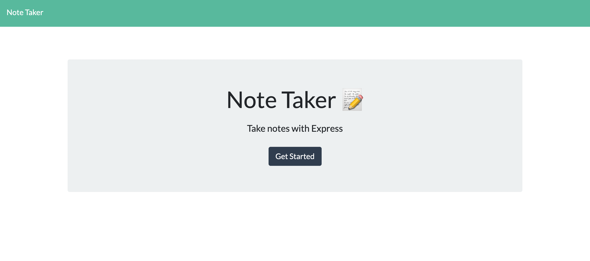
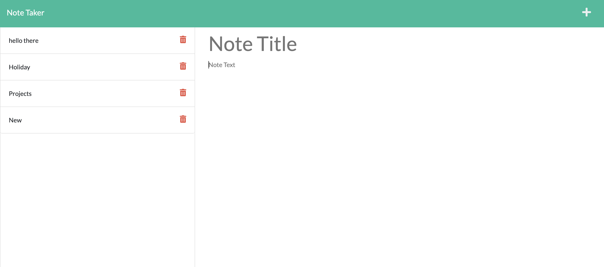

# Note-Taker-App

[](https://note-taking-app-heroku.herokuapp.com/)

[](https://opensource.org/licenses/MIT)

## Table of Contents

- [Description](#description)
- [User Story](#user-story)
- [Deployed App](#deployed-app)
- [Getting Started](#getting-started)
- [Project Screenshots](#project-screenshots)
- [Questions](#questions)

## Description

The goal of this project was to modify starter code to create an application called Note Taker that can be used to write and save notes using an Express.js back end to retrieve note data from a JSON file.

## User Story

```
AS A small business owner
I WANT to be able to write and save notes
SO THAT I can organize my thoughts and keep track of tasks I need to complete

```

## Deployed App

[Heroku deployed link](https://note-taking-app-heroku.herokuapp.com/)

## Getting Started

### Installation

```
git clone git@github.com:Amalidi/Note-Taker-App.git
cd Note-Taker-App
```

### Once complete, run the program in the terminal:

```
npm run start
```

## Project Screenshots





## Questions

If you have any questions about this application, please contact me by [email](mailto:A.idi12@outlook.com).
